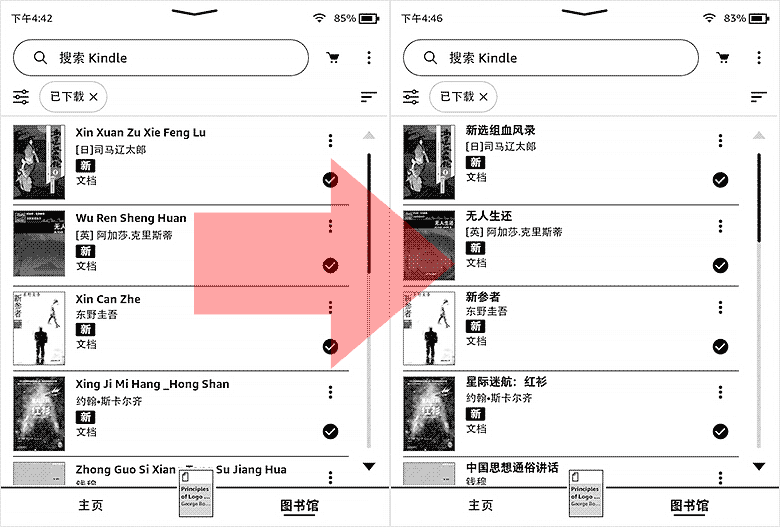

# Send To Kindle Calibre Plugin

這個 calibre 外掛會把選取的電子書透過信箱寄到 Kindle，並讓你在送出前先改成想顯示的書名。

---

## 安裝方式

請先確認系統已安裝 __[Calibre](https://calibre-ebook.com/)__，再用下列任一方式安裝：

1. 直接下載 __[releases page](https://github.com/bookfere/Send-to-Kindle-Calibre-Plugin/releases)__ 的外掛 zip。
2. 在 Calibre 選單依序點選 __[Preference... → Plug-ins → Load plug-in from file]__，再選擇剛下載的 zip。
3. 重新啟動 Calibre。

如果你想安裝最新版，也可以從 GitHub repository 直接打包：

<pre><code>git clone https://github.com/bookfere/Send-to-Kindle-Calibre-Plugin.git
cd Send-to-Kindle-Calibre-Plugin
git archive --format zip --output ../Send-to-Kindle-Calibre-Plugin.zip master</code></pre>

如果 Calibre 選單裡看不到 "Send to Kindle"，請到 __[Preference... → Toolbars & menus]__，選 __[The main toolbar]__，找到這個外掛，按 __[>]__，再按 __[Apply]__。

---

## 使用方式

1. 選取要寄出的電子書，點擊 "Send to Kindle"。
2. 把書名改成你想在 Kindle 上顯示的名稱。
3. 按下 __[Send to Kindle]__。

送出後，可以在右下角的 "Jobs" 查看處理進度。

---

## 使用條件

- 這個外掛會使用 Calibre 已設定好的寄信資訊。
- 需要先在 Calibre 的電子郵件分享設定中，填好可用的寄送信箱與 Kindle 收件地址。
- 若你有設定多個 Kindle 信箱，可以在外掛設定頁面勾選要使用的收件人。

---

## 授權

[GNU General Public License v3.0](https://www.gnu.org/licenses/gpl-3.0.en.html)

---

* GitHub：[https://github.com/bookfere/Send-to-Kindle-Calibre-Plugin](https://github.com/bookfere/Send-to-Kindle-Calibre-Plugin)
* Releases：[https://bookfere.com/post/1042.html](https://bookfere.com/post/1042.html)
* Donate：[https://bookfere.com/donate](https://bookfere.com/donate)
